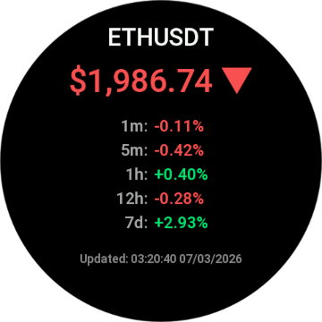
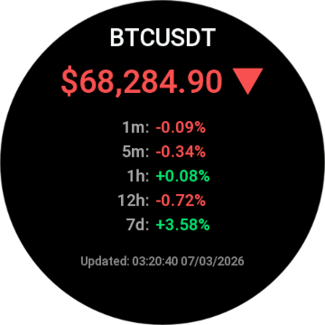
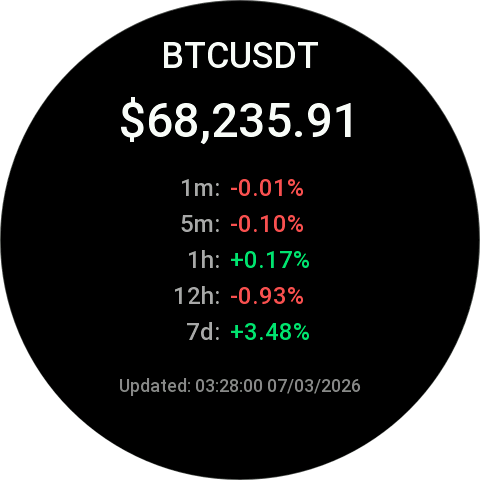
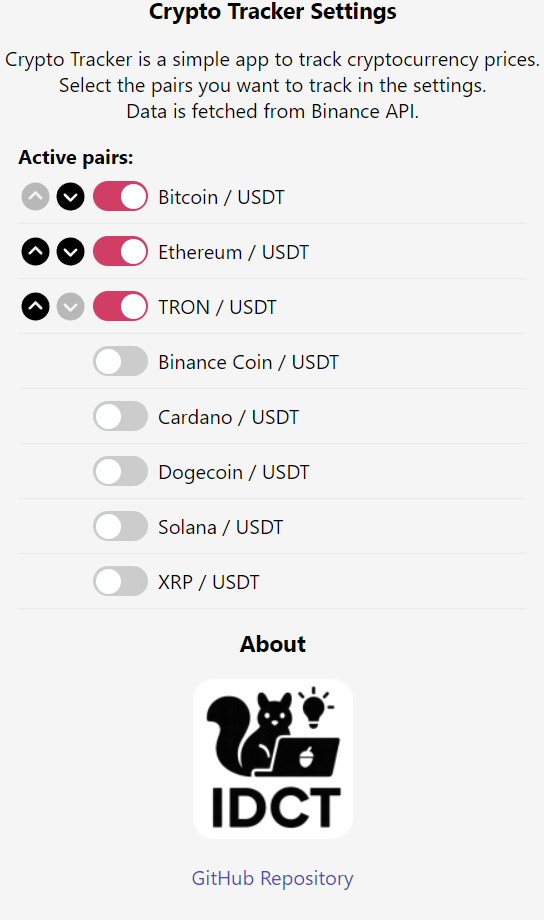

# Crypto Tracker for Zepp OS

Crypto Tracker is a Zepp OS Mini Program for Amazfit smartwatches that shows live crypto prices and multi-timeframe percentage changes on-device.

The app renders the watch UI on the device, fetches market data through the phone-side service, and lets users choose and reorder tracked pairs from the Zepp companion settings page.

## Screenshots

<p align="center">
  
  
  
  
</p>

<p align="center">
  
</p>

## Features

- **Live prices** — current price displayed with up/down direction arrows and color coding (green/red)
- **Multi-timeframe changes** — percentage change for 1m, 5m, 1h, 12h, and 7d intervals
- **Multiple pairs** — swipe between pages to view different cryptocurrencies
- **Auto-refresh** — prices update automatically every 10 seconds
- **Configurable** — select and reorder tracked pairs from the Zepp companion app
- **Multi-device** — supports both round (480×480) and square (390×390) Amazfit screens

## Requirements

- Zepp OS API 3.5 compatible runtime
- Zeus CLI for local development and packaging
- Zepp OS Simulator or a supported Amazfit watch for testing
- Network access on the paired phone so the app-side service can fetch price data

## Supported Pairs

| Pair      | Name          |
|-----------|---------------|
| BTCUSDT   | Bitcoin       |
| ETHUSDT   | Ethereum      |
| BNBUSDT   | Binance Coin  |
| ADAUSDT   | Cardano       |
| DOGEUSDT  | Dogecoin      |
| SOLUSDT   | Solana        |
| TRXUSDT   | TRON          |
| XRPUSDT   | XRP           |

All pairs are quoted against USDT. The watch does not call Binance directly. Instead, the phone-side service fetches a JSON payload from `https://crypto-tracker.idct.tech/prices.json`, which currently mirrors Binance-based market data for the app.

## Architecture

The app follows the Zepp OS Mini Program architecture:

- **Watch side** (`page/index.js`) — renders the UI using Zepp OS widget APIs, displays prices with color-coded change indicators, and supports vertical swipe navigation between pairs.
- **Phone side** (`app-side/index.js`) — runs on the companion phone, fetches price data from the backend, and relays it to the watch via the Zepp OS messaging API.
- **Settings** (`setting/index.js`) — provides a configuration UI inside the Zepp companion app for selecting and reordering tracked pairs.

### Data Flow

1. The watch page loads the last saved symbol list from device-local storage so it can build the swiper immediately.
2. The watch asks the phone-side service for the latest settings and price payload.
3. The phone-side service fetches market data and returns it to the watch with Zepp OS request/response messaging.
4. The settings page stores the selected symbol list in companion settings storage.
5. When settings change, the phone-side service pushes `SETTINGS_CHANGED` to the watch so the visible pages update without waiting for a restart.

## Zepp OS Constraints

- Watch UI is built with Zepp widget APIs, not HTML or CSS.
- Network requests belong in `forex-ticker/app-side/index.js`, not in watch-side page code.
- The page count for the vertical swiper is fixed when the UI is built, so symbol changes update existing pages in-place during the current session.
- Layout constants are split by device shape: round (`index.r.layout.js`) and square (`index.s.layout.js`).

## Getting Started

### Prerequisites

- [Zeus CLI](https://docs.zepp.com/docs/guides/tools/cli/) (`@zeppos/zeus-cli`)
- [Zepp OS Simulator](https://docs.zepp.com/docs/guides/tools/simulator/) (for testing without a physical device)
- A supported Amazfit device, if you want to test on hardware

### Installation

1. Clone the repository:

   ```bash
   git clone https://github.com/ideaconnect/zeppos-crypto-tracker.git
   cd zeppos-crypto-tracker
   ```

2. Install dependencies:

   ```bash
   cd forex-ticker
   npm install
   ```

3. Run in the simulator:

   ```bash
   zeus dev
   ```

4. To build for deployment:

   ```bash
   zeus build
   ```

### Build Output

Successful builds generate a `.zab` package in `forex-ticker/dist/`, which can be installed through the usual Zepp OS tooling flow.

## Configuration

Open the Zepp companion app on your phone, navigate to the Crypto Tracker settings, and:

- **Enable/disable** pairs using the toggle switches
- **Reorder** pairs using the up/down arrow buttons
- At least one pair must remain active

Changes are pushed to the watch in real time.

### Persistence Model

- The companion app stores the selected symbol list in settings storage.
- The watch caches the latest symbol list in local storage to avoid rendering an empty swiper on launch.
- If no saved settings exist yet, the watch falls back to a small default symbol set.

## Project Structure

```
forex-ticker/
├── app.js                  # App entry point (lifecycle hooks)
├── app.json                # App manifest (permissions, targets, pages)
├── app-side/
│   └── index.js            # Phone-side companion logic (API calls)
├── page/
│   ├── index.js            # Watch UI rendering and data display
│   ├── index.r.layout.js   # Layout constants for round screens (480×480)
│   └── index.s.layout.js   # Layout constants for square screens (390×390)
├── setting/
│   └── index.js            # Settings page (Zepp companion app)
└── assets/                 # Bundled image/resource files
```

## Development Notes

- `page/index.js` is the main watch-side runtime and contains the widget update logic, swiper setup, and refresh timer.
- `app-side/index.js` is the only place that should perform network requests.
- `setting/index.js` defines the companion configuration UI and persists symbol order.
- `page/index.r.layout.js` and `page/index.s.layout.js` keep device-specific coordinates separate from the watch page logic.

## Troubleshooting

- If prices do not update, verify the paired phone has network access and the backend URL is reachable.
- If changed pairs do not appear immediately, reopen the page on the watch so the swiper can be rebuilt with the latest page count.
- If simulator builds fail, confirm you are running commands from `forex-ticker/` and that Zeus CLI is installed.

# 💖 Love my work? Support it! 🚀

* ☕ **Buy me a coffee**: https://buymeacoffee.com/idct
* 💝 **Sponsor**: https://github.com/sponsors/ideaconnect
* 🪙 **BTC**: bc1qntms755swm3nplsjpllvx92u8wdzrvs474a0hr
* 💎 **ETH**: 0x08E27250c91540911eD27F161572aFA53Ca24C0a
* ⚡ **TRX**: TVXWaU4ScNV9RBYX5RqFmySuB4zF991QaE
* 🚀 **LTC**: LN5ApP1Yhk4iU9Bo1tLU8eHX39zDzzyZxB

## License

This project is licensed under the [MIT License](LICENSE).

## Author

**IDCT Bartosz Pachołek** — [idct.tech](https://idct.tech)
